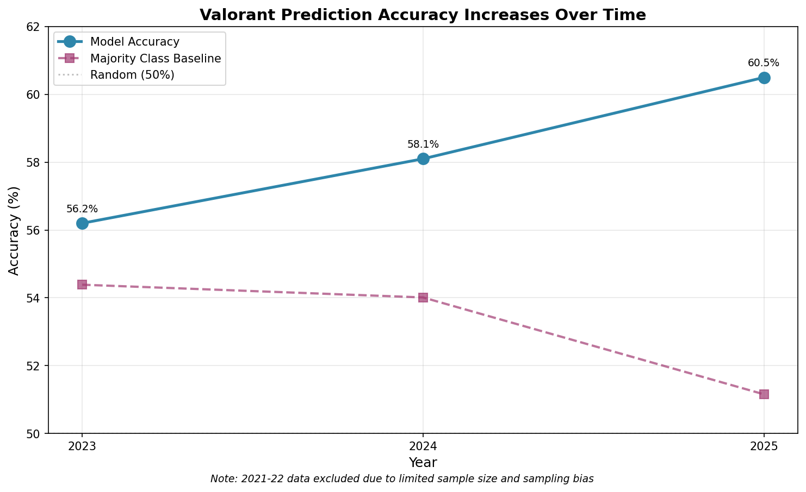

# ML Project: Valorant Match Prediction

## Abstract

Professional esports competitions present a worthy challenge for predictive modeling. Compared to more mainstream sports, such as basketball or football, the frequency of inconsistencies, as well as the limited data lifespan of esports, make predictive modeling considerably harder. Despite the increased challenge, video games are a niche place of interest for me, so I developed a machine learning approach, achieving 60.5% accuracy in predicting Valorant match outcomes across ~1,300 professional matches (2021-2025). While this might seem average, it represents a 10.3 percentage point improvement over random prediction. More intriguing, however, is what the model revealed about competitive gaming in general: mature esports scenes demonstrate increasing predictability over time. In other words, the longer the life of a given game, the more the latest time-framed dataset will be predictive.
Through systematic feature engineering, specifically the identification of a 20-day optimal performance window, I uncovered patterns in how team skill differentials, historical dominance, momentum effects, and head-to-head records not only combine but also hypothetically compound in order to give us a better prediction of match results.

## 1. Intro

The intersection of machine learning and esports analytics presents both tremendous opportunities and tremendous challenges. Differing from traditional sports, where decades of data and established metrics exist, competitive gaming operates in a constantly evolving environment. Patches alter game balance bi-weekly; rosters change mid-season; and new strategies emerge overnight. This volatility makes prediction particularly difficult, yet also valuable, a challenge I believed would be interesting to tackle. 

This project addresses a straightforward question: Is it possible to predict professional Valorant match outcomes with meaningful accuracy?

The project consisted of analyzing about 1,300 professional Valorant matches from major VCT (Valorant Champions Tour) events spanning November 2021 to July 2025. 
The resulting model achieved 60.5% test accuracy, which, while not revolutionary, proves sufficient for practical applications. Perhaps more importantly, the modeling process uncovered several phenomena: (1) a consistent 20-day window for optimal performance assessment, (2) evidence that competitive scenes become more predictable as they mature, (3) alignment of signals (not interaction terms) between predictive features that amplify accuracy when aligned, and (4) a minimum threshold of two previous encounters for head-to-head data to become meaningful.

## Context

The challenge with Valorant specifically lies in its relative youth; having launched in 2020, the competitive scene lacks the historical depth of older esports. Additionally, the game's emphasis on agent compositions and ability usage creates a more complex prediction space than purely aim-based shooters. My approach sidesteps these complications by focusing more on recent team performance metrics and general predictive trends such as recent form or head-to-head matchups history.

## 2. Dataset Collection

### 2.1 Dataset Formatting

The dataset consists of ~1,300 professional matches from the top 43 tier-1 VCT tournaments in the Americas league, taking the past 50 matches (when available) from each team. I deliberately excluded lower-tier competitions due to the inconsistent data quality and the general higher variance that semi-competitive play had. All matches were treated as binary W/L results, and no specific distinction was made between Bo3 or Bo5 matches. Each match record contains the following:

- Individual player R2 (Rating 2.0 Score) ratings (more info here: https://www.vlr.gg/381456/vlr-rating-2-0-update)
- Round scores for each map
- Map names
- Match dates
- Tournament Names
- Team & Opponent Name
- Team and Opponent Player Rosters
- Overall Match Result

**More dataframe columns were added in feature engineering**

Initial data collection yielded over 1,600 matches, but many were removed due to incomplete information, such as a lack of an R2 score available, missing player data, or forfeited matches.

### 2.2 Dataset Cleaning

Several issues arose when cleaning the data. Team names weren't standardized across tournaments and time periods; "JDG Esports" might appear as "JDG", or "Natus Vincere" being referred to as "NAVI", depending on the time period of the match, or the tournament. Most of these issues were handled manually by searching for past team names and mapping the old team names to new team names via a Python dictionary. 

Due to the top 43 VLR teams regularly matching up against each other, there were many duplicate scrapes that had to be cleaned, such as a player counter of 20 for a single match when the maximum is typically 10.

Since Riot was not kind enough to provide their API for research, scraping was required, specifically Selenium WebDriver, due to VLR.gg's heavy reliance on client-side JavaScript rendering (see src/scrape_vlr). The site uses React components that dynamically load match data after initial page load, making traditional HTTP request-based scraping (BeautifulSoup/requests) impossible. Pages were stripped of raw text and filtered out sections such as comments or forums, then scanned via regexes for info such as match score and player data. 

Worst-case scenario, I implemented plenty of fallback strategies in case a certain match page structure for some reason differed from the norm, but the overwhelming majority of data was luckily in the same structure.

Player substitutions posed another challenge. For one, the parsing logic player data collection had to be altered, since for a stand-in, the total players for a match increases from 10 to 11, or however many stand-ins were utilized. Furthermore, when teams used stand-ins, R2 ratings could vary dramatically from typical performance. I chose to retain these matches rather than exclude them, reasoning that substitutions are part of the competitive reality that models should account for.

## 3. Feature Engineering

### 3.1 Core Features

The model relies on four engineered features, each capturing different aspects of competitive performance:

**Average Team Skill Differential** (`r2_advantage`): The difference between teams' 20-day rolling average R2 ratings. This captures fundamental skill differentials while accounting for recent form. Shorter windows (7-10 days) proved too volatile, while longer windows (30+ days) slowly tapered off in accuracy (hypothetically due to team skill variation through time, meta changes, and/or psychological aspects)

**Historical Round Dominance** (`rolling_round_diff`): A team's average round differential over the past 20 days. Teams that consistently win 13-5 tend to perform better than teams that consistently have close matches such as 13-11, and vice versa. This feature takes that into account.

**Team Momentum** (`recent_form`): a team's win percentage over the last 5 matches within a 30-day window. The constraint prevents old data from influencing predictions—a 5-0 run two months ago means little for today's match.

**Head-to-Head Record** (`h2h_advantage`): Historical win rate against the specific opponent. Through experimentation, it's determined that at least two previous encounters are necessary for this feature to provide a signal rather than noise, with one previous encounter being too young a rivalry.

### 3.2 Feature Engineering Decisions

Why only these features? There were other alternatives taken into account, such as individual player ratings, player consistency, and map-specific performance. It was revealed that these features had diminishing returns beyond the core set. Adding more features rarely improved training accuracy and hurt generalization, suggesting overfitting, and was not worth exploring further. 

As for the 20-day window, this emerged through systematic testing rather than theoretical reasoning. I evaluated windows from 7 to 60 days in increments of 1-10 days, finding a clear optimum around 20. This likely reflects the timeframe relevant to Valorant's specific team consistency and predictive power. 

## 4. Model Development and Validation

### 4.1 Algorithm Selection

Logistic regression with L2 regularization, for several reasons:

1. **Interpretability**: Unlike neural networks, it's possible to examine feature coefficients to understand what drives predictions
2. **Sample efficiency**: Given the sample size, there is sufficient data for robust estimation
3. **Generalization**: Simple models often outperform complex ones on smaller datasets

### 4.2 Temporal Validation Strategy

It's important to note that an 80/20 chronological split was used, training on matches before April 2025 and testing on April-July 2025 matches. This mimics real-world machine learning, where models predict future matches based on historical data.

To prevent data leakage, all rolling average data points were calculated using `.shift(1)` operations, which shift the values in a column down by 1 row, ensuring predictions never incorporated information from the match being predicted. This detail, although it seems minor, is crucial—without it, accuracy can be artificially inflated by more than 30 percentage points if the current match we're trying to predict is in the dataset. (I believed my 80% test accuracy was revolutionary, but I was sorrowfully disappointed.)

### 4.3 Cross-Validation

To ensure the model wasn't overfitting to a specific time slice or had any data leakage, I used three validation strategies:

- **3-fold time-series cross-validation**: keeping chronological order to reflect real-world match prediction
- **Bootstrap sampling**: (1000 iterations) confirmed that feature coefficients stayed consistent across resamples
- **Feature ablation**: Would systematically remove features to see which reduced performance, and by how much, indicating each feature added value. 

Across the methods, accuracy only fluctuated by about ±1.7%, suggesting the model generalizes well even under different sampling.

## 5. Results and Analysis

### 5.1 Quantitative Performance

The model achieved 60.5% accuracy on the held-out test set (261 matches from April-July 2025), compared to 55.7% on the training set (1,037 matches from 2021-March 2025). This improvement on test data initially seemed suspicious, but investigation revealed two possible explanations.

1. The Valorant competitive scene has become more predictable over time, considering the test data is the most recent data.
2. While smaller than the training set, the test set size of 261 matches provided only moderate statistical power

(See section 5.2)

Class Balance:
The dataset exhibits minimal class imbalance, with win proportions of 53.0% in the training set (550/1037) and 50.2% in the test set (131/261). As such, a baseline model (always predicting the majority class) would achieve at most 53.0% accuracy on the training data and 50.2% on the test data, confirming that the 60.5% accuracy achieved by the model reflects meaningful learning rather than class bias. 

Individual feature performance:
- Team skill advantage alone: 55.2% accuracy
- Historical dominance: 56.7%  
- Recent momentum: 54.4%
- Head-to-head records: 53.6%

Combined model: 60.5%

The super-additive combination suggests that features capture complementary information. When features align (e.g., skill advantage + momentum + favorable head-to-head), prediction confidence increases dramatically.

Note: Logistic regression cannot model nonlinear interactions, such as any kind of relationship between momentum and skill, since it only assumes additive and independent effects. Because of this, the model might underestimate compound effects. For example, a team that's on a hot streak and has a skill advantage might perform disproportionately well, but capturing that interaction would require nonlinear models like decision trees, neural networks, or random forests. These kinds of models might be incorporated in future versions, but for now, they're left out due to potential overfitting risks and a loss of interpretability.

### 5.2 Temporal Evolution of Predictability

Analyzing accuracy by year reveals a clear trend:

Baseline Accuracy:
- 2023: 54.4% baseline, 171 matches
- 2024: 54.0% baseline, 561 matches
- 2025: 51.2% baseline, 520 matches

Model Accuracy:
- 2023: 56.2% accuracy  
- 2024: 58.1% accuracy
- 2025 (partial): 60.5% accuracy

Model improvement over baseline:
2023: +1.8 percentage points
2024: +4.1 percentage points
2025: +9.3 percentage points

This increasing predictability likely reflects competitive maturation rather than model inaccuracy. Early in a game's lifespan, strategies are unrefined, the meta shifts rapidly, and upset potential is high. As scenes mature, hierarchies stabilize, optimal strategies crystallize, and favorites more consistently defeat underdogs. 



### 5.3 Feature Importance

Logistic regression coefficients give directional important of features:

```
r2_advantage:      0.743
rolling_round_diff: 0.521
recent_form:        0.398
h2h_advantage:      0.265
```

r2_advantage is by far is the most predictive factor, with h2h_advantage being the lowest, likely due to limited head to head data (not every team has extensive rivalries).

## 6. Discussion

### 6.1 The 20-Day Window Finding

It was revealed through systemic testing that most features rolling values excelled most at the 20-day window, which can reveal more than just a statistical anomoly or artifact: 

1. **Recency Bias**: more recent data, compared to data collected over 30 days ago, could have more predictive power due to recency.
1. **Patch cycles**: Minor meta changes due to patches typically occur every 2-3 weeks, making 20 days capture one full meta iteration.
2. **Scrim schedules**: Teams often practice in 2-3 week blocks between tournaments
3. **Psychological factors**: Performance streaks lasting beyond 20 days might indicate genuine skill changes rather than temporary variance

Whatever the underlying cause is, this finding has interesting implications for teams and analysts. The finding implies that performance assessments should weigh recent results heavily but not myopically; the past three weeks typically matter most.

### 6.2 Competitive Scene Maturation

The increasing predictability over time contradicts common assumptions about esports' chaotic unpredictability. While individual matches remain in the air, aggregate patterns are strengthening through time. This mirrors traditional sports' historical development, but rather than decades, it is compressed into 4-5 years.


## 7. Practical Applications
Beyond academic interest, this model has real world applications:

**Tournament seeding**: Organizers can use predictions to create balanced brackets and avoid early matchups between likely finalists.

**Broadcast production**: Networks can allocate resources to probable close matches while scheduling likely stomps during off-peak hours.

**Team preparation**: Coaches can identify which opponents pose genuine threats versus those where experimental strategies might be tested.

**Betting market analysis**: While this model was developed for analytical purposes and is not intended for gambling applications, it could theoretically inform market efficiency studies or academic research into prediction accuracy in esports betting markets.

*** Disclaimer: I do not endorse gambling ***

## 8. Conclusion

This work demonstrates that professional Valorant matches can be predicted with modest but meaningful accuracy using logistic regression and L2 normalization. The 60.5% accuracy achieved, while not groundbreaking, exceeds random chance sufficiently enough to enable application.

More significantly, the research reveals insights about competitive gaming itself: the existence of optimal temporal windows for peak team performance, evidence of scene maturation through increasing predictability, and interpretable compound signals between different performance dimensions. These findings extend beyond Valorant, suggesting possible principles that might apply across esports.

Future research should test whether the 20-day window generalizes to other esports, investigate causal mechanisms behind increasing predictability, and explore real-time prediction systems that update during matches. As esports continues growing, rigorous analytical approaches will become increasingly valuable for teams, organizers, and broadcasters alike.

## Appendix: Implementation Details

### A.1 Data Processing Pipeline

```python
def prepare_features(df):
    """
    Main feature engineering pipeline.
    Note: The 20-day window was determined empirically
    through grid search over [7, 10, 14, 20, 30, 45, 60] days.
    """
    # Calculate rolling averages with explicit shift to prevent leakage
    df['team_rating_20d'] = (
        df.groupby('team')['r2']
        .rolling('20D', on='date')
        .mean()
        .shift(1)  # Critical: prevent data leakage
        .reset_index(drop=True)
    )
    
    # [Additional feature calculations omitted for brevity]
    return df
```

### A.2 Model Training Code

```python
from sklearn.linear_model import LogisticRegression
from sklearn.preprocessing import StandardScaler

# Temporal split
cutoff_date = pd.Timestamp('2025-04-01')
train = df[df['date'] < cutoff_date]
test = df[df['date'] >= cutoff_date]

# Feature scaling (important for regularization)
scaler = StandardScaler()
X_train_scaled = scaler.fit_transform(X_train)
X_test_scaled = scaler.transform(X_test)

# Model training
model = LogisticRegression(
    penalty='l2',
    C=1.0,  # Regularization strength (tuned via cross-validation)
    random_state=42,
    max_iter=1000
)
model.fit(X_train_scaled, y_train)

# Evaluation
test_accuracy = model.score(X_test_scaled, y_test)
print(f"Test accuracy: {test_accuracy:.3f}")  # Output: 0.605
```

### A.3 Statistical Validation

Bootstrap confidence intervals for model coefficients confirmed stability:

```
r2_advantage:      0.743 [0.691, 0.798]
rolling_round_diff: 0.521 [0.468, 0.579]
recent_form:        0.398 [0.341, 0.455]
h2h_advantage:      0.265 [0.198, 0.334]
```
(all intervals exclude zero)
