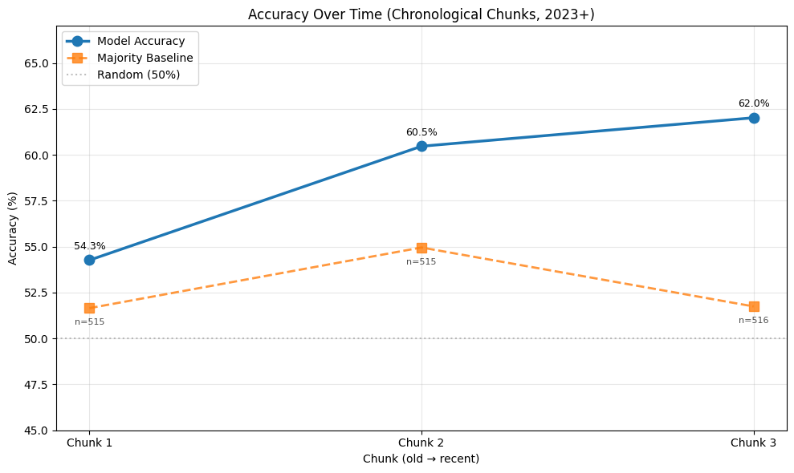
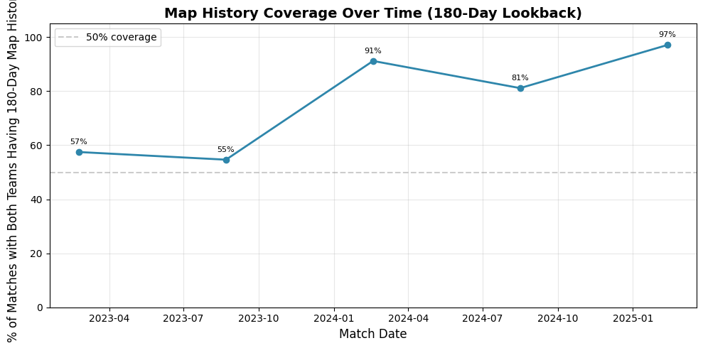
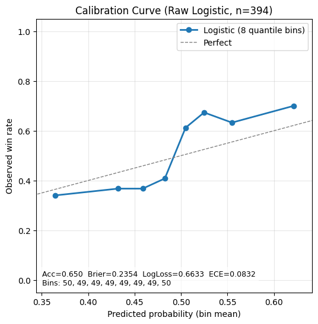

# 🎯 ML Pipeline: Valorant Match Outcome Prediction

*By Zaid Nimer · z.nimer@outlook.com*

---

### [▶️ Run Here!](https://valorant-match-predictor-o078.onrender.com/)


<details>
<summary><b>How to use</b></summary>

- Pick **two teams** and a **date window**; get the model’s **win probability** and predicted winner.
- **Adjust temporal split** to simulate “what was knowable then” (prevents leakage).
- See a **calibrated confidence** score.

</details>

**Description**: This project predicts **professional VALORANT match outcomes** using **regularized logistic regression** *(see Future Work for planned ensemble baselines)* on data from the **top 43 Americas VCT teams** from Feb 2023 – Jul 2025 (1,546 matches).  

**Focus**: **interpretable features**, **time-based validation**, and **calibration** — ensuring model accuracy and confidence. 

Why logistic regression? It’s interpretable—I wanted to avoid black-box models and inspect feature weights to see which features contribute most to wins. I’ll benchmark additional models next.

<details>
<summary><h3>🎮 VALORANT & Context </h3></summary>


**VALORANT** is a competitive 5v5 tactical first-person shooter (FPS) developed by Riot Games, containing a variety of maps, agents, and strategies.

**Professional VALORANT** features the world's best teams competing in international tournaments with millions in prize pools. Matches are played on different maps, each with unique layouts and strategies. Teams build reputations for excellence on specific maps (their "map pool"), and individual players are rated on their performance metrics like kills, deaths, and round impact. Professional match data can be primarily found on [VLR.gg](https://www.vlr.gg)

**Why predict match outcomes?** Unlike traditional sports, esports generates vast amounts of granular data. Every round, every player action, and every strategic decision is tracked, making it an ideal domain for machine learning applications while remaining challenging due to the complex team dynamics and evolving meta-game strategies. 

*Prior work on pre-match esports prediction typically lands near the low-60s—for example, CS:GO models around 60% and LoL pre-game-only models around ~62%—with higher accuracy requiring in-game signals. 
[CS:GO Model](https://lup.lub.lu.se/luur/download?func=downloadFile&recordOId=9145457&fileOId=9145459)
[LOL Model](https://www.mdpi.com/2076-3417/15/10/5241)*
</details>

---

## 📊 Key Results
(temporal split; test n=394)
- **Test Accuracy:** **65.0%** (95% CI: [60.2%, 69.3%])
- **Brier Score:** 0.2354  
- **Log Loss:** 0.6633  
- **ECE:** 0.0832 (well-calibrated)
- **Baseline:** 51.3% → **+13.7 pp improvement**
- **Statistical significance:** binomial test vs majority (51.3%) **p < 1e-6**

---

## ⚙️ Technical Details
- **Model:** L2-regularized Logistic Regression (C=10.0)
- **Framework:** scikit-learn
- **Preprocessing:** None (feature engineering produces normalized values)
- **Train/Test Split:** 75/25 temporal split (cutoff: July 2025)
- **Dependencies:** see [requirements.txt](requirements.txt)

---

## 💻 Installation

If you're interested in playing around with the model or testing out new features:

```bash
git clone https://github.com/zaza-op/valorant-match-predictor
cd valorant-match-predictor
pip install -r requirements.txt
```

---

## 🧩 Features

1. `map_pool_advantage` - Measures how well a team's historical map pool win rate aligns against the opponent's historical map pool win rate. (Looks back 180 days, weighted with exponential decay)
2. `r2_advantage` - Each player per match is given an R2 rating from VLR.gg (player performance metric), this takes the rolling monthly mean R2 rating of each team. *(see more on R2 rating [here](https://www.vlr.gg/381456/vlr-rating-2-0-update))*
3. `winrate_advantage`- Difference in recent match win rates between teams.
4. `recent_form` - Captures short term momentum specific to team performance (weighted with exponential decay)
5. `consistency_advantage`- Measures variability/consistency in team R2 score within a given number of days
6. `rolling_round_diff` - Rolling average of round differential (total rounds won minus total rounds lost) over recent matches, (weighted with exponential decay)

Features were chosen based on feature combination script written, *(see notebooks/features2.ipynb)*. The script returns the top 5 feature combinations given all features passed in.

Used .shift(1) so features only use information **before** the current match while training/testing, preventing data leakage.

More feature details can be found in *notebooks/00_data_inspect.ipynb*

---

## 🗂 Dataset
- **Matches:** 1,546
- **Date Range:** Feb 2023 – Jul 2025

---

## 🛠 Data Collection
- **Method:** Custom Selenium-based scraper built specifically for VLR.gg (see src/scrape_vlr.py)
- **Why:** No official/accessible Riot API for Valorant match data, and VLR.gg is React-based with dynamic content, making static parsing with BeautifulSoup scraping insufficient.
- **Process:**  
  - Extracted and parsed raw page text from dynamically rendered content  
  - Utilized regex extensively to capture and structure key data fields  
  - Standardized team and player names across inconsistent formats  
  - Removed irrelevant sections (comments, forums, ads) to reduce noise  
  - Built fallback parsing logic for non-standard or malformed layouts  
  - Addressed edge cases such as player substitutions and missing R2 ratings
- **Outcome:** A clean, research-ready dataset of 1,546 professional Valorant matches spanning 2023–2025

---

## ✅ Model Validation

<details>
<summary><h3>📊 Ablation Results & Temporal Cross-Validation (click to expand)</h3></summary> 

### Feature Ablation Analysis
**Leave-One-Out Impact on Test Performance:**

| Removed Feature | Test Acc | 95% CI | Δ vs Full | McNemar p | Significance |
|------------------|----------|--------|-----------|-----------|--------------|
| **None (full)** | **65.0%** | [60.1%, 69.5%] | **0.00pp** | - | - |
| `map_pool_advantage` | 58.4% | [53.5%, 63.1%] | **-6.60pp** | 0.0034 | ⭐⭐ |
| `r2_advantage` | 62.2% | [57.3%, 66.8%] | -2.79pp | 0.0708 | ⭐ |
| `recent_form` | 62.9% | [58.1%, 67.6%] | -2.03pp | 0.1849 | - |
| `consistency_advantage` | 63.2% | [58.3%, 67.8%] | -1.78pp | 0.2810 | - |
| `winrate_advantage` | 63.5% | [58.6%, 68.1%] | -1.52pp | 0.4966 | - |
| `rolling_round_diff` | 64.2% | [59.4%, 68.8%] | -0.76pp | 0.6900 | - |

**Key Insights:**
- `map_pool_advantage` is **critical** (-6.6pp when removed, p=0.003)
- `r2_advantage` provides **moderate value** (-2.8pp, p=0.071) 
- Other features contribute **incrementally** but aren't individually essential
- All features combined achieve optimal performance

*⭐⭐ p < 0.01, ⭐ p < 0.10*

### Cross-Validation Performance
**Time-Based CV Results:**
| Fold | Train Acc | Val Acc | Train Size | Val Size | Gap |
|------|-----------|---------|------------|----------|-----|
| 1    | 60.3%     | 58.6%   | 310        | 309      | -1.7pp |
| 2    | 58.5%     | 57.0%   | 619        | 309      | -1.5pp |
| 3    | 58.7%     | 58.3%   | 928        | 309      | -0.5pp |
| 4    | 58.3%     | 65.4%   | 1237       | 309      | +7.1pp |

**CV Mean:** 59.8% ± 3.3%  
**Bootstrap Stability:** 61.1% ± 2.0%

### Individual Feature Performance
| Feature | Solo Test Acc | Train-Test Gap |
|---------|---------------|----------------|
| `winrate_advantage` | 58.4% | +2.2pp |
| `recent_form` | 55.6% | +1.7pp |
| `r2_advantage` | 55.3% | +1.4pp |
| `map_pool_advantage` | 53.8% | -3.8pp |
| `rolling_round_diff` | 53.8% | -1.7pp |
| `consistency_advantage` | 50.5% | -1.2pp |

</details>

### 📈 Performance Over Time



**Chunk Analysis:**

515 matches each, n = 129

| Chunk   | Date Range                  | Baseline | Model | Δ      |
|---------|-----------------------------|----------|-------|--------|
| Chunk 1 | 2023-02-23 – 2024-06-22     | 51.7%    | 54.3% | +2.6 pp |
| Chunk 2 | 2024-06-22 – 2025-02-09     | 55.0%    | 60.5% | +5.5 pp |
| Chunk 3 | 2025-02-09 – 2025-07-13     | 51.7%    | 62.0% | +10.3 pp |




**Map History Coverage by Date:**
| Date | Matches | History Coverage |
|------|---------|------------------|
| 2023-02-23 | 167 | 57.5% |
| 2023-08-22 | 86 | 54.7% |
| 2024-02-18 | 466 | 91.2% |
| 2024-08-16 | 313 | 81.2% |
| 2025-02-12 | 514 | 97.1% |

**Key Insights:**
- Since `map_pool_advantage` is the most predictive factor, and includes a 180-day lookback, accuracy is lower in earlier chunks (lack of past map data) compared to later chunks, explaining increased predictive power in later dataset as well as test set.
- Through feature engineering and experimentation, 180-day lookback was found to have the most predictive power out of timeframes tested

### ⚖️ Calibration 
  
*(Raw logistic regression, n=394)*

---


## ⚠️ Limitations

- Small dataset size (1,546 matches) → Limits generalization, increases variance in performance estimates, limits team-specific insights.

- Temporal data imbalance → Early matches have less complete historical data, affecting time-based features such as `map_pool_advantage`

- Static Model → no online learning for meta shifts or roster changes (would have to rescrape)
  
- Feature correlation → some features capture similar signals

---

## 📁 Project Structure
```
├── app/               # interactive web app code
├── images/            # all images
├── data/              # Raw and processed match data
├── notebooks/         # Data exploration & refining, feature engineering & visualization
├── src/              # Web scraping & feature engineering code 
├── README.md         # This file
└── requirements.txt  # dependencies
```

---

## 🚀 Future Work
- User-facing match prediction given live data. (currently static)
- (Attempt) to gain public API access for live predictions
- Expand feature set
- Working on decreasing test + train gap for stability & better calibration
- Test tree-based ensemble methods that can capture non-linear feature interactions and typically perform better in esports. (random forest/xgboost/gradient boosting).
- Add stratification post-split for better class balance.
- Add features for tournament tier/context (stakes matter for performance)
- Dataset expansion for increased model quality

---
